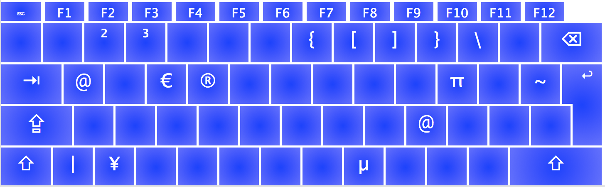

# Deutsches Windows-PC-Tastaturlayout für macOS
Dieses Repository enthält ein deutsches Windows-PC-Tastaturlayout für macOS.

Windows-PC-Tastaturlayout bedeutet in diesem Fall, dass die Sonderzeichen (z.B. `{` oder `]`) an der gleichen Stelle liegen wie auf einer Windows-PC-Tastatur.

## Sonderzeichen
Unterstützte Sonderzeichen bei gedrückter `Alt`-Taste:

## Dead-Keys
Die Zeichen ^, \` und ´ sind Dead-Keys. 

Das Zeichen ~ ist kein Dead-Key.

## Installation
Das `.dmg`-Image herunterladen (siehe Releases) und Anweisungen folgen.

Alternativ: Dieses Reposiotry herunterladen und das Bundle `pc-win-de-keyboard` nach `/Library/Keyboard Layouts` kopieren.

## Aktivieren
Das Layout wird die Systemsteuerung -> Tastatur -> Eingabequellen aktiviert.

Unten auf das `+` klicken und dann das Layout `PC-Windows Deutsch` in der Sprache `Deutsch` auswählen.

Das bisherigen Layout kann man dann entfernen (um versehentliches Zurückwechseln zum bisherigen Layout zu verhindern.) Eventuell muss der Rechner neugestartet werden, damit das geht.

## Bearbeiten des Layouts
Das Layout bearbeitet man am besten mit dem Tool [Ukulele](http://scripts.sil.org/ukelele).

Das `.dmg`-Image zum Verteilen erstellt man in Ukulele über das Menü: File -> Install -> Export Installer Disk Image...
